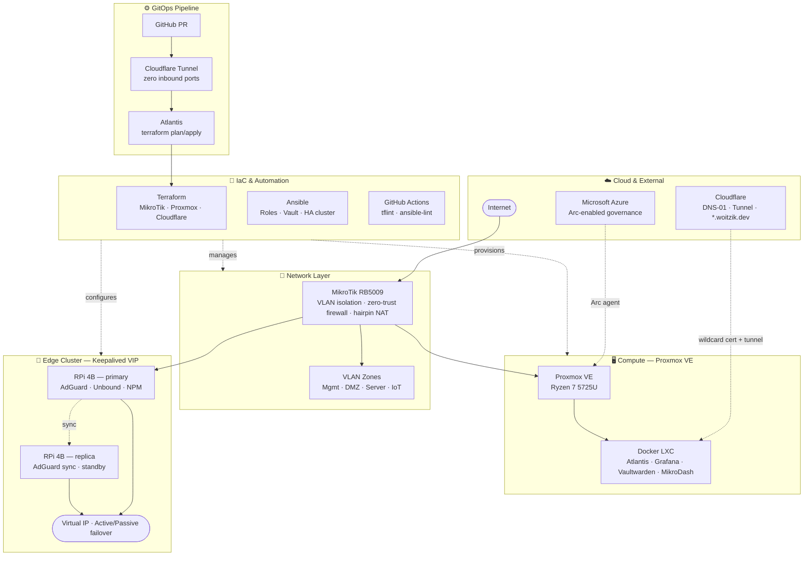

[](https://github.com/dwoitzik/homelab-infrastructure/actions/workflows/ci.yml)


# Homelab Infrastructure as Code

Configuration and automation for a highly available, secure homelab environment. This project manages the full lifecycle of local hardware, network routing, and integrated cloud services entirely through automated Infrastructure as Code workflows — from bare metal provisioning to application deployment.

> All infrastructure changes flow through **Atlantis** (self-hosted GitOps) via pull requests. No manual `terraform apply` or ad-hoc changes.

## 🛠️ Infrastructure Stack

| Layer | Technology |
|---|---|
| Hypervisor | Proxmox VE (Ryzen 7 5725U) |
| Networking | MikroTik RB5009 (RouterOS) |
| Edge nodes | 2× Raspberry Pi 4B (Debian) |
| Reverse proxy & SSL | Nginx Proxy Manager + Let's Encrypt wildcard |
| DNS & ad-blocking | AdGuard Home + Unbound (recursive) |
| Monitoring | Prometheus + Grafana + node exporter + SNMP |
| Secrets | Ansible Vault + Vaultwarden |
| Security | CrowdSec firewall bouncer |
| GitOps | Atlantis (self-hosted, Cloudflare Tunnel) |
| Cloud governance | Microsoft Azure Arc |

## 🗺️ Architecture



## 📁 Repository Layout

```
homelab-infrastructure/
├── ansible/                  # Configuration management
│   ├── roles/                # One role per service
│   ├── playbooks/            # site.yml + targeted playbooks
│   ├── group_vars/           # Variables + Ansible Vault secrets
│   └── inventory.ini         # Host inventory
├── terraform/
│   └── stacks/
│       └── network/          # MikroTik firewall, VLANs, NAT (active)
├── docker/                   # Compose file references
├── docs/
│   └── decisions/            # Architecture Decision Records (ADRs)
├── network/                  # RouterOS scripts
├── atlantis.yaml             # GitOps project config
└── .github/workflows/        # CI pipeline
```

## 🚀 Core Architectural Concepts

### 1. GitOps with Atlantis
All Terraform changes are applied exclusively through pull requests. Atlantis runs `terraform plan` automatically on every PR and posts the diff as a comment. Applying requires an explicit `atlantis apply` comment — no direct CLI access to production. Atlantis is exposed via Cloudflare Tunnel with zero inbound ports open.

### 2. High Availability & Clustering
Active/Passive failover across both Raspberry Pi edge nodes using Keepalived with a shared Virtual IP. AdGuard Home configuration is continuously replicated from primary to replica via `adguardhome-sync`. Failover is transparent to clients — no reconfiguration needed.

### 3. Privacy-First DNS Resolution
Unbound runs as a full recursive resolver, querying root DNS servers directly with no upstream provider. AdGuard Home sits in front for filtering and ad-blocking. Kernel network buffers are tuned via Ansible for high-volume UDP throughput.

### 4. Zero-Trust Network Security
Strict VLAN segmentation across Management, DMZ, Server, and IoT zones. MikroTik forward/input chains default-drop with explicit accept rules per flow. CrowdSec firewall bouncer runs on DMZ nodes. All firewall rules are managed as Terraform resources — no manual RouterOS changes.

### 5. Observability
Prometheus scrapes node exporter metrics from all hosts and SNMP metrics from the MikroTik router. Grafana provides dashboards for host health, network traffic, and DNS query rates.

### 6. Secrets Management
Ansible Vault encrypts all credentials at rest. Vaultwarden provides a self-hosted password manager for operational secrets. No secrets committed to the repository in plaintext.

## 🔄 Making Changes

### Infrastructure (Terraform)
```bash
git checkout -b feature/my-change
# edit terraform/stacks/network/*.tf
git push origin feature/my-change
# open PR → Atlantis posts terraform plan automatically
# comment "atlantis apply" to apply
```

### Configuration (Ansible)
```bash
# dry run
ansible-playbook ansible/playbooks/site.yml --check --vault-password-file ansible/.ansible_vault_pass

# apply to specific hosts
ansible-playbook ansible/playbooks/site.yml --limit app_nodes --vault-password-file ansible/.ansible_vault_pass
```

## 📖 Documentation

- [Architecture Decision Records](docs/decisions/)
- [Ansible roles](ansible/README.md)
- [Terraform stacks](terraform/README.md)
