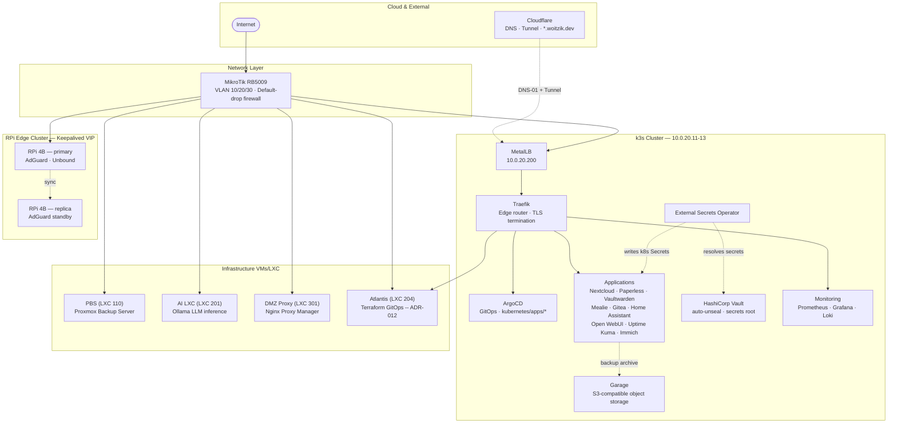

[](https://github.com/dwoitzik/homelab-infrastructure/actions/workflows/ci.yml)


# Homelab Infrastructure as Code

My homelab, fully managed as code: MikroTik firewall rules, Proxmox VMs/LXCs, and everything running on top in Kubernetes. Everything goes through a pull request — I don't apply changes by hand.

Start with [docs/OPERATIONS.md](docs/OPERATIONS.md) if you want to know where things live, where secrets are kept, or how I've debugged this stuff before.

## Stack Overview

| Layer | Technology |
|---|---|
| Hypervisor | Proxmox VE (Ryzen 7 5825U, 64 GB RAM) |
| Networking | MikroTik RB5009 (Terraform-managed firewall) |
| Edge DNS | 2× Raspberry Pi 4B — AdGuard Home + Unbound |
| Kubernetes | k3s v1.31 — 3-node cluster. Intended/documented design is single control-plane + etcd (see `docs/k3s-architecture.md`); live topology has drifted to 2-member etcd, a known issue with a fix proposed in [ADR-014](docs/decisions/ADR-014-etcd-topology.md), not yet applied. |
| Ingress + TLS | Traefik + cert-manager (wildcard `*.woitzik.dev` via DNS-01) |
| Storage | NFS (`ct-srv-nfs-01`, ZFS-backed) — Longhorn fully removed |
| GitOps (k8s) | ArgoCD — ApplicationSet watching `kubernetes/apps/*` |
| GitOps (TF) | Atlantis — self-hosted, exposed via Cloudflare Tunnel |
| Auth | Authelia — SSO/OIDC for all protected services |
| VPN | Headscale (self-hosted Tailscale control plane), OIDC login via Authelia |
| Secrets | Ansible Vault (host-level) + HashiCorp Vault w/ auto-unseal (k8s, via ExternalSecrets) |
| Backups | Velero → Garage S3 (k8s, incl. PVC data via Kopia) + Proxmox Backup Server (VMs/LXCs). Neither offsite leg is active yet — see `docs/backup-strategy.md`. |

## Architecture


```mermaid
graph TB
    subgraph cloud["Cloud & External"]
        NET([Internet])
        CF["Cloudflare\nDNS · Tunnel · *.woitzik.dev"]
    end

    subgraph router["Network Layer"]
        MK["MikroTik RB5009\nVLAN 10/20/30 · Default-drop firewall"]
    end

    subgraph k3s["k3s Cluster — 10.0.20.11-13"]
        LB["MetalLB\n10.0.20.200"]
        TR["Traefik\nEdge router · TLS termination"]
        ARGO["ArgoCD\nGitOps · kubernetes/apps/*"]
        APPS["Applications\nNextcloud · Paperless · Vaultwarden\nMealie · Gitea · Home Assistant\nOpen WebUI · Uptime Kuma · Immich"]
        VAULT["HashiCorp Vault\nauto-unseal · secrets root"]
        ESO["External Secrets Operator"]
        GARAGE["Garage\nS3-compatible object storage"]
        MON["Monitoring\nPrometheus · Grafana · Loki"]
    end

    subgraph edge["RPi Edge Cluster — Keepalived VIP"]
        RPI1["RPi 4B — primary\nAdGuard · Unbound"]
        RPI2["RPi 4B — replica\nAdGuard standby"]
    end

    subgraph infra["Infrastructure VMs/LXC"]
        PBS["PBS (LXC 110)\nProxmox Backup Server"]
        AI["AI LXC (LXC 201)\nOllama LLM inference"]
        DMZ["DMZ Proxy (LXC 301)\nNginx Proxy Manager"]
        ATLLXC["Atlantis (LXC 204)\nTerraform GitOps -- ADR-012"]
    end

    NET --> MK
    CF -. "DNS-01 + Tunnel" .-> LB
    MK --> LB
    LB --> TR
    TR --> ARGO
    TR --> APPS
    TR --> MON
    TR --> ATLLXC
    ESO -. "resolves secrets" .-> VAULT
    ESO -. "writes k8s Secrets" .-> APPS
    APPS -. "backup archive" .-> GARAGE
    MK --> RPI1
    RPI1 -. "sync" .-> RPI2
    MK --> PBS
    MK --> AI
    MK --> DMZ
    MK --> ATLLXC
```

## Repository Layout

```text
├── kubernetes/
│   ├── apps/                  # ArgoCD-managed workloads (ApplicationSet picks up any new folder)
│   │   ├── authelia/          # SSO / OIDC identity provider
│   │   ├── cloudflared/       # Cloudflare Tunnel
│   │   ├── garage/            # S3-compatible object storage
│   │   ├── gitea/             # Private git instance
│   │   ├── headscale/         # Tailscale control plane
│   │   ├── home-assistant/    # Smart home hub
│   │   ├── homepage/          # Dashboard
│   │   ├── immich/            # Photo library (Cloudflare Tunnel external access)
│   │   ├── jellyfin/          # External-service pointer to the GPU-passthrough LXC
│   │   ├── keel/              # Image auto-update
│   │   ├── mealie/            # Recipe manager
│   │   ├── myspeed/           # Internet speed-test history
│   │   ├── nextcloud/         # Files · CalDAV · CardDAV
│   │   ├── open-webui/        # Local LLM interface (Ollama)
│   │   ├── paperless/         # Document management + paperless-gpt
│   │   ├── renovate/          # Dependency update bot
│   │   ├── searxng/           # Self-hosted metasearch
│   │   ├── uptime-kuma/       # Uptime monitoring
│   │   └── vaultwarden/       # Password manager
│   └── system/                # Manually-applied system components
│       ├── argocd/            # ArgoCD config (RBAC, OIDC)
│       ├── cert-manager/      # TLS certificate automation (+ cert-manager-config/, certificates/)
│       ├── chaos-mesh/        # Scheduled pod-kill / latency-injection experiments
│       ├── cloudnative-pg/    # CNPG operator (Authelia Postgres)
│       ├── external-secrets/  # External Secrets Operator
│       ├── infrastructure/    # sysctl-fix DaemonSet, Cloudflare DDNS, misc cluster glue
│       ├── kyverno/           # Policy engine (resource limits, no-latest-tag, no-privileged)
│       ├── metallb/           # LoadBalancer IPs (+ metallb-config/)
│       ├── monitoring/        # kube-prometheus-stack + Loki + Tempo + PVE exporter
│       ├── nfs-provisioner/   # nfs-client StorageClass
│       ├── postgres/          # Authelia PostgreSQL
│       ├── redis/             # Authelia Redis
│       ├── tempo/             # Distributed tracing backend
│       ├── traefik/           # Traefik ingress (+ traefik-config/)
│       ├── vault/             # HashiCorp Vault + auto-unseal sidecar
│       ├── velero/            # Cluster backup to Garage S3 (Cloudflare R2 offsite configured, not yet active)
│       ├── apps-ingressroute.yml   # All app IngressRoutes
│       └── other-ingressroute.yml  # System IngressRoutes (ArgoCD, Grafana)
├── terraform/
│   └── stacks/
│       ├── cloudflare/        # Tunnel config + DNS records (Terraform-managed, applied via Atlantis)
│       ├── network/           # MikroTik — VLANs, firewall, DHCP, NAT
│       └── proxmox/           # VMs and LXC containers, incl. ct-srv-atlantis-01 (ADR-012)
├── ansible/
│   ├── roles/                # One role per service (22 roles) -- incl. the DMZ hosts:
│   │                         # minecraft, nginx_proxy_manager, crowdsec_bouncer,
│   │                         # watchtower, monitoring_agent (docker-based node_exporter
│   │                         # + promtail for rpi_nodes/dmz_proxies/dmz_games; every
│   │                         # other host group uses node_exporter_native instead)
│   ├── group_vars/           # Variables + Ansible Vault secrets
│   ├── k3s-cluster/          # k3s provisioning (install, upgrade, reset)
│   └── inventory.ini
├── docs/
│   ├── decisions/             # ADRs
│   └── *.md                   # Architecture, naming, topology, VLAN docs
├── network/
│   └── scripts/bootstrap.rsc  # MikroTik initial bootstrap (RouterOS script)
├── atlantis.yaml              # Atlantis — stack definitions
└── .github/workflows/ci.yml   # Terraform lint + Ansible lint
```

## Kubernetes Services

| Service | URL | Auth |
|---|---|---|
| Homepage | home.woitzik.dev | Authelia |
| ArgoCD | argo.woitzik.dev | Authelia OIDC |
| Grafana | monitoring.woitzik.dev | Authelia OIDC |
| Traefik | traefik.woitzik.dev | Authelia |
| Uptime Kuma | status.woitzik.dev | Authelia |
| Paperless-ngx | docs.woitzik.dev | Authelia |
| Open WebUI | ai.woitzik.dev | Authelia |
| Vaultwarden | vault.woitzik.dev | Built-in |
| Nextcloud | nextcloud.woitzik.dev | Built-in |
| Mealie | mealie.woitzik.dev | Authelia |
| Gitea | git.woitzik.dev | Built-in |
| Home Assistant | ha.woitzik.dev | Built-in |
| Headscale | headscale.woitzik.dev | Built-in |
| Atlantis | atlantis.woitzik.dev | Authelia (except `/events` webhook: GitHub HMAC) |
| Immich | photos.woitzik.dev | Built-in |
| Jellyfin | media.woitzik.dev | Built-in |
| Jellyseerr | requests.woitzik.dev | Built-in |
| AdGuard Home | dns.woitzik.dev | Authelia |
| Proxmox VE | pve.woitzik.dev | Authelia |
| PBS | backup.woitzik.dev | Authelia |
| MikroTik (RouterOS webfig) | router.woitzik.dev | Authelia |
| Garage S3 | s3.woitzik.dev | Key auth |

## VLAN Layout

| VLAN | Zone | Subnet | Key Hosts |
|---|---|---|---|
| 10 | Management | 10.0.10.0/24 | Proxmox (10.0.10.10), PBS (10.0.10.110), MikroTik API (10.0.10.1) |
| 20 | Server | 10.0.20.0/24 | k3s (10.0.20.11-13), RPi (10.0.20.2-3), MetalLB (10.0.20.200) |
| 30 | DMZ | 10.0.30.0/24 | Proxy (10.0.30.2), Games (10.0.30.3) |
| 40 | IOT | 10.0.40.0/24 | Untrusted / smart-home devices, restricted internet only |
| 100 | Admin | 10.0.100.0/24 | Trusted admin workstations -- only zone allowed into VLAN 10 |

Full detail (physical port mapping, firewall policy) in [docs/vlan-segmentation.md](docs/vlan-segmentation.md).

## Terraform Workflow

All Terraform changes go through Atlantis (self-hosted GitOps):

```bash
git checkout -b feature/my-change
# edit terraform/stacks/network/*.tf or terraform/stacks/proxmox/*.tf
git push && gh pr create
# Atlantis auto-plans on PR open
# comment "atlantis apply" on the PR to apply
# merge after apply succeeds
```

I never run `terraform apply` locally. Everything goes through Atlantis.

## Ansible Workflow

```bash
# Dry run
ansible-playbook ansible/site.yml --check

# Apply to specific group
ansible-playbook ansible/site.yml --limit rpi_nodes

# Edit secrets
ansible-vault edit ansible/group_vars/all/vault.yml
```

## Adding a New k8s Service

1. Create `kubernetes/apps/<service>/<service>.yml` with Deployment + Service + PVC
2. ArgoCD ApplicationSet auto-detects the new directory and deploys it
3. Add IngressRoute to `kubernetes/system/apps-ingressroute.yml`
4. Run `kubectl apply -f kubernetes/system/apps-ingressroute.yml`

## Monitoring

Prometheus scrapes metrics from all hosts:

- k3s nodes: DaemonSet node_exporter (10.0.20.11-13)
- Raspberry Pis: node_exporter Docker container (10.0.20.2-3)
- Docker LXC: node_exporter Docker container (10.0.20.252)
- AI LXC + PBS: node_exporter native binary (10.0.20.251, 10.0.10.110)
- Proxmox host: prometheus-pve-exporter in-cluster (10.0.10.10)

Grafana dashboards: Node Exporter Full (1860), Proxmox PVE (10347, 19022).

## Documentation

- [Architecture Decision Records](docs/decisions/)
- [k3s Cluster Architecture](docs/k3s-architecture.md)
- [VLAN Segmentation](docs/vlan-segmentation.md)
- [Backup Strategy](docs/backup-strategy.md)
- [SSO Setup (Proxmox/PBS)](docs/SSO_SETUP.md)
- [Naming Convention](docs/naming-convention.md)
- [Roadmap](ROADMAP.md)
