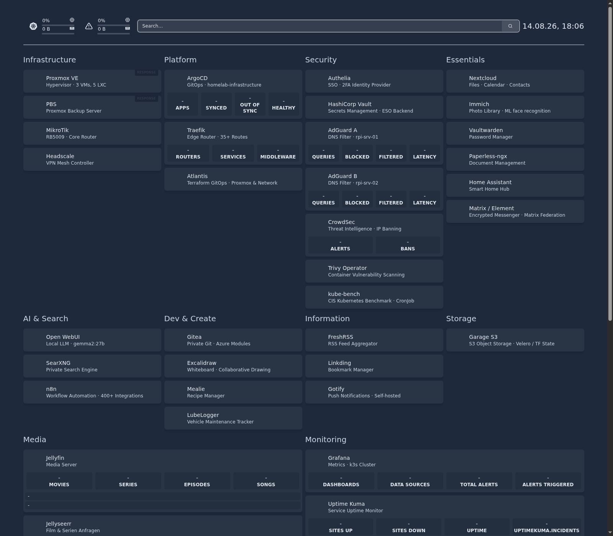

[](https://github.com/dwoitzik/homelab-infrastructure/actions/workflows/ci.yml)


# Homelab Infrastructure as Code

A homelab, fully managed as code: MikroTik firewall rules, Proxmox VMs/LXCs, and ~30
self-hosted applications running on top in Kubernetes, all applied through GitOps, none
of it by hand. It exists to be genuinely used day to day — not a demo cluster spun up to
have something to show — and it's also a record of what running real infrastructure
looks like: a from-nothing disaster recovery (`docs/RECOVERY-REPORT-2026-08-13.md`), the
architecture decisions that came out of it (`docs/decisions/`, 28 ADRs), and an honest
closing assessment of what still needs work (`docs/POST-MISSION.md`).

**What this demonstrates**: GitOps discipline (every change is a PR, Terraform applies
only via Atlantis, Kubernetes only via ArgoCD), root-causing real production incidents
rather than guessing, an explicit default-deny security posture (network segmentation,
public exposure as an allowlist, secrets in Vault, policy enforcement via Kyverno), and
documentation that stays honest about what's still open rather than only what's done.

Start with [docs/STEADY-STATE.md](docs/STEADY-STATE.md) for how this actually runs day
to day, or [docs/OPERATIONS.md](docs/OPERATIONS.md) for where things live, where secrets
are kept, and how I've debugged this stuff before.

## Stack Overview

| Layer | Technology |
|---|---|
| Hypervisor | Proxmox VE (Ryzen 7 5825U, 64 GB RAM) |
| Networking | MikroTik RB5009 (Terraform-managed firewall) |
| Edge DNS | 2× Raspberry Pi 4B — AdGuard Home + Unbound |
| Kubernetes | k3s v1.31 — 3-node cluster (1 control-plane, 2 workers), embedded SQLite datastore, not etcd — see [ADR-015](docs/decisions/ADR-015-k3s-datastore-sqlite.md). A single-server (not 3-way HA) topology by design, not drift — see [ADR-014](docs/decisions/ADR-014-etcd-topology.md) for why 3-way embedded-etcd HA is specifically ruled out on this hardware. |
| Ingress + TLS | Traefik + cert-manager (wildcard `*.woitzik.dev` via DNS-01) |
| Storage | NFS (`ct-srv-nfs-01`, ZFS-backed) — Longhorn fully removed |
| GitOps (k8s) | ArgoCD — ApplicationSet watching `kubernetes/apps/*` |
| GitOps (TF) | Atlantis — self-hosted, exposed via Cloudflare Tunnel |
| Auth | Authelia — SSO/OIDC for all protected services |
| VPN | Headscale (self-hosted Tailscale control plane), OIDC login via Authelia |
| Secrets | Ansible Vault (host-level) + HashiCorp Vault w/ auto-unseal (k8s, via ExternalSecrets) |
| Backups | Velero → Garage S3 (k8s, incl. PVC data via Kopia), daily offsite to Cloudflare R2 (with a usage guard that pauses it before hitting the free-tier cap), + Proxmox Backup Server (VMs/LXCs). Restore is tested automatically, monthly — see `docs/STEADY-STATE.md`. |

## Architecture


```mermaid
graph TB
    subgraph cloud["Cloud & External"]
        NET([Internet])
        CF["Cloudflare\nDNS · Tunnel · *.woitzik.dev"]
    end

    subgraph router["Network Layer"]
        MK["MikroTik RB5009\nVLAN 10/20/30 · Default-drop firewall"]
    end

    subgraph k3s["k3s Cluster — 10.0.20.11-13"]
        LB["MetalLB\n10.0.20.200"]
        TR["Traefik\nEdge router · TLS termination"]
        ARGO["ArgoCD\nGitOps · kubernetes/apps/*"]
        APPS["Applications\nNextcloud · Paperless · Vaultwarden\nMealie · Gitea · Home Assistant\nOpen WebUI · Uptime Kuma · Immich"]
        VAULT["HashiCorp Vault\nauto-unseal · secrets root"]
        ESO["External Secrets Operator"]
        GARAGE["Garage\nS3-compatible object storage"]
        MON["Monitoring\nPrometheus · Grafana · Loki"]
    end

    subgraph edge["RPi Edge Cluster — Keepalived VIP"]
        RPI1["RPi 4B — primary\nAdGuard · Unbound"]
        RPI2["RPi 4B — replica\nAdGuard standby"]
    end

    subgraph infra["Infrastructure VMs/LXC"]
        PBS["PBS (LXC 110)\nProxmox Backup Server"]
        AI["AI LXC (LXC 201)\nOllama LLM inference"]
        DMZ["DMZ Proxy (LXC 301)\nNginx Proxy Manager"]
        ATLLXC["Atlantis (LXC 204)\nTerraform GitOps -- ADR-012"]
    end

    NET --> MK
    CF -. "DNS-01 + Tunnel" .-> LB
    MK --> LB
    LB --> TR
    TR --> ARGO
    TR --> APPS
    TR --> MON
    TR --> ATLLXC
    ESO -. "resolves secrets" .-> VAULT
    ESO -. "writes k8s Secrets" .-> APPS
    APPS -. "backup archive" .-> GARAGE
    MK --> RPI1
    RPI1 -. "sync" .-> RPI2
    MK --> PBS
    MK --> AI
    MK --> DMZ
    MK --> ATLLXC
```

## Screenshots



The dashboard (self-hosted [Homepage](https://github.com/gethomepage/homepage)) — every
service grouped by function, live status widgets where the service supports one. Public
Grafana/ArgoCD screenshots aren't included here: both require an authenticated login
(Authelia SSO) to view anything beyond the sign-in page, so there's nothing meaningful
to capture without live operator credentials — see `docs/URL-INVENTORY.md` for what's
actually reachable and how.

**Currency note (2026-08-23)**: `home.woitzik.dev` is behind the same Authelia gate,
so this screenshot can only be refreshed by someone with a real login session — checked
live, an unauthenticated request only reaches the Authelia sign-in page. The image
above is dated 2026-08-14 and several widgets in it show placeholder `-` values (a real
CrowdSec widget auth bug, fixed same-session — see `phase8/LEDGER.md`) that would read
real numbers today. Flagging this honestly rather than leaving a screenshot that reads
as current when it isn't; refresh it opportunistically next time someone with an actual
browser session is looking at the dashboard.

## Repository Layout

```text
├── kubernetes/
│   ├── apps/                  # ArgoCD-managed workloads (ApplicationSet picks up any new folder)
│   │   ├── authelia/          # SSO / OIDC identity provider
│   │   ├── beszel/            # Lightweight server monitoring
│   │   ├── cloudflared/       # Cloudflare Tunnel
│   │   ├── crowdsec/          # Collaborative IPS, bans malicious IPs at the Traefik edge
│   │   ├── excalidraw/        # Collaborative whiteboard
│   │   ├── firefly/           # Personal finance manager
│   │   ├── freshrss/          # RSS reader
│   │   ├── garage/            # S3-compatible object storage
│   │   ├── gitea/             # Private git instance
│   │   ├── gotify/            # Push notification server
│   │   ├── headscale/         # Tailscale control plane
│   │   ├── home-assistant/    # Smart home hub
│   │   ├── homepage/          # Dashboard
│   │   ├── immich/            # Photo library (Cloudflare Tunnel external access)
│   │   ├── jellyfin/          # External-service pointer to the GPU-passthrough LXC
│   │   ├── keel/               # Image auto-update
│   │   ├── kube-bench/        # CIS Kubernetes benchmark, scheduled
│   │   ├── linkding/          # Bookmark manager
│   │   ├── lubelogger/        # Vehicle maintenance log
│   │   ├── matrix/            # Synapse homeserver + Element web client
│   │   ├── mealie/            # Recipe manager
│   │   ├── myspeed/           # Internet speed-test history
│   │   ├── n8n/                # Workflow automation
│   │   ├── nextcloud/         # Files · CalDAV · CardDAV
│   │   ├── onlyoffice/        # Office document editing (Nextcloud integration)
│   │   ├── open-webui/        # Local LLM interface (Ollama)
│   │   ├── paperless/         # Document management + paperless-gpt
│   │   ├── renovate/          # Dependency update bot
│   │   ├── scrutiny/          # Disk S.M.A.R.T. monitoring UI
│   │   ├── searxng/           # Self-hosted metasearch
│   │   ├── trivy-operator/    # Continuous container vulnerability scanning
│   │   ├── uptime-kuma/       # Uptime monitoring
│   │   └── vaultwarden/       # Password manager
│   │
│   │   # Two IngressRoute patterns coexist, not fully unified yet: older apps
│   │   # route through the centralized kubernetes/system/apps-ingressroute.yml,
│   │   # newer ones (beszel, excalidraw, firefly, freshrss, gotify, linkding,
│   │   # lubelogger, matrix, myspeed, n8n, onlyoffice, searxng) declare their
│   │   # own IngressRoute inline in their own directory. Both work; picking one
│   │   # convention and migrating the rest is open, tracked in docs/ROADMAP.md.
│   └── system/                # Manually-applied system components
│       ├── argocd/            # ArgoCD config (RBAC, OIDC)
│       ├── cert-manager/      # TLS certificate automation (+ cert-manager-config/, certificates/)
│       ├── chaos-mesh/        # Scheduled pod-kill / latency-injection experiments
│       ├── cloudnative-pg/    # CNPG operator (Authelia Postgres)
│       ├── external-secrets/  # External Secrets Operator
│       ├── infrastructure/    # sysctl-fix DaemonSet, Cloudflare DDNS, misc cluster glue
│       ├── kyverno/           # Policy engine (resource limits, no-latest-tag, no-privileged)
│       ├── metallb/           # LoadBalancer IPs (+ metallb-config/)
│       ├── monitoring/        # kube-prometheus-stack + Loki + Tempo + PVE exporter
│       ├── nfs-provisioner/   # nfs-client StorageClass
│       ├── postgres/          # Authelia PostgreSQL
│       ├── redis/             # Authelia Redis
│       ├── tempo/             # Distributed tracing backend
│       ├── traefik/           # Traefik ingress (+ traefik-config/)
│       ├── vault/             # HashiCorp Vault + auto-unseal sidecar
│       ├── velero/            # Cluster backup to Garage S3 (Cloudflare R2 offsite configured, not yet active)
│       ├── apps-ingressroute.yml   # All app IngressRoutes
│       └── other-ingressroute.yml  # System IngressRoutes (ArgoCD, Grafana)
├── terraform/
│   └── stacks/
│       ├── cloudflare/        # Tunnel config + DNS records (Terraform-managed, applied via Atlantis)
│       ├── network/           # MikroTik — VLANs, firewall, DHCP, NAT
│       └── proxmox/           # VMs and LXC containers, incl. ct-srv-atlantis-01 (ADR-012)
├── ansible/
│   ├── roles/                # One role per service (22 roles) -- incl. the DMZ hosts:
│   │                         # minecraft, nginx_proxy_manager, crowdsec_bouncer,
│   │                         # watchtower, monitoring_agent (docker-based node_exporter
│   │                         # + promtail for rpi_nodes/dmz_proxies/dmz_games; every
│   │                         # other host group uses node_exporter_native instead)
│   ├── group_vars/           # Variables + Ansible Vault secrets
│   ├── k3s-cluster/          # k3s provisioning (install, upgrade, reset)
│   └── inventory.ini
├── docs/
│   ├── decisions/             # ADRs
│   └── *.md                   # Architecture, naming, topology, VLAN docs
├── network/
│   └── scripts/bootstrap.rsc  # MikroTik initial bootstrap (RouterOS script)
├── atlantis.yaml              # Atlantis — stack definitions
└── .github/workflows/ci.yml   # Terraform lint + Ansible lint
```

## Kubernetes Services

Every hostname below resolves and works from the LAN or over the Headscale/Tailscale
VPN. **Only two are actually reachable from the public internet** — everything else
is deliberately allowlisted out of Cloudflare's DNS/tunnel entirely, an explicit
default-deny decision (`ADR-033`), not an oversight. See `docs/URL-INVENTORY.md` for
the full external-reachability audit.

| Service | URL | Auth | Reachable from |
|---|---|---|---|
| Homepage | home.woitzik.dev | Authelia | LAN/VPN only |
| ArgoCD | argo.woitzik.dev | Authelia OIDC | LAN/VPN only |
| Grafana | monitoring.woitzik.dev | Authelia OIDC | LAN/VPN only |
| Traefik | traefik.woitzik.dev | Authelia | LAN/VPN only |
| Uptime Kuma | status.woitzik.dev | Authelia | LAN/VPN only |
| Paperless-ngx | docs.woitzik.dev | Authelia | LAN/VPN only |
| Open WebUI | ai.woitzik.dev | Authelia | LAN/VPN only |
| Vaultwarden | vault.woitzik.dev | Built-in | LAN/VPN only |
| Nextcloud | nextcloud.woitzik.dev | Built-in | LAN/VPN only |
| Mealie | mealie.woitzik.dev | Authelia | LAN/VPN only |
| Gitea | git.woitzik.dev | Built-in | LAN/VPN only |
| Home Assistant | ha.woitzik.dev | Built-in | LAN/VPN only |
| Headscale | headscale.woitzik.dev | Built-in | **Public** — structurally required, a device has to reach this before any VPN path exists |
| Atlantis | atlantis.woitzik.dev | Authelia (except `/events` webhook: GitHub HMAC) | LAN/VPN only |
| Immich | photos.woitzik.dev | Rate-limited, own login | **Public** — family photo access is a real, named use case |
| Jellyfin | media.woitzik.dev | Built-in | LAN/VPN only |
| Jellyseerr | requests.woitzik.dev | Built-in | LAN/VPN only |
| AdGuard Home | dns.woitzik.dev | Authelia | LAN/VPN only |
| Proxmox VE | pve.woitzik.dev | Authelia | LAN/VPN only |
| PBS | backup.woitzik.dev | Authelia | LAN/VPN only |
| MikroTik (RouterOS webfig) | router.woitzik.dev | Authelia | LAN/VPN only |
| Garage S3 | s3.woitzik.dev | Key auth | LAN/VPN only |
| Wazuh (SIEM) | wazuh.woitzik.dev | Built-in | LAN/VPN only |
| Vault | secrets.woitzik.dev | Built-in | LAN/VPN only |
| Loki | loki.woitzik.dev | Authelia | LAN/VPN only |
| Scrutiny | scrutiny.woitzik.dev | Authelia | LAN/VPN only |
| Beszel | beszel.woitzik.dev | Authelia | LAN/VPN only |
| Firefly III | finance.woitzik.dev | Authelia | LAN/VPN only |
| FreshRSS | rss.woitzik.dev | Authelia | LAN/VPN only |
| Gotify | gotify.woitzik.dev | Authelia | LAN/VPN only |
| Linkding | links.woitzik.dev | Authelia | LAN/VPN only |
| LubeLogger | cars.woitzik.dev | Authelia | LAN/VPN only |
| Matrix/Synapse + Element | matrix.woitzik.dev, element.woitzik.dev | Federation protocol / Authelia | LAN/VPN only |
| MySpeed | speed.woitzik.dev | Authelia | LAN/VPN only |
| n8n | n8n.woitzik.dev | Authelia | LAN/VPN only |
| OnlyOffice | onlyoffice.woitzik.dev | Authelia | LAN/VPN only |
| SearXNG | search.woitzik.dev | Authelia | LAN/VPN only |
| Excalidraw | draw.woitzik.dev | Authelia | LAN/VPN only |
| Minecraft | mc.woitzik.dev | Server-side auth | **Public** — via a playit.gg relay tunnel, not the Cloudflare allowlist above (raw TCP, can't route through Cloudflare's CDN); the DMZ LXC it runs on has no cluster credentials and no path to any other VLAN |

## VLAN Layout

| VLAN | Zone | Subnet | Key Hosts |
|---|---|---|---|
| 10 | Management | 10.0.10.0/24 | Proxmox (10.0.10.10), PBS (10.0.10.110), MikroTik API (10.0.10.1) |
| 20 | Server | 10.0.20.0/24 | k3s (10.0.20.11-13), RPi (10.0.20.2-3), MetalLB (10.0.20.200) |
| 30 | DMZ | 10.0.30.0/24 | Proxy (10.0.30.2), Games (10.0.30.3) |
| 40 | IOT | 10.0.40.0/24 | Untrusted / smart-home devices, restricted internet only |
| 100 | Admin | 10.0.100.0/24 | Trusted admin workstations -- only zone allowed into VLAN 10 |

Full detail (physical port mapping, firewall policy) in [docs/vlan-segmentation.md](docs/vlan-segmentation.md).

## Terraform Workflow

All Terraform changes go through Atlantis (self-hosted GitOps):

```bash
git checkout -b feature/my-change
# edit terraform/stacks/network/*.tf or terraform/stacks/proxmox/*.tf
git push && gh pr create
# Atlantis auto-plans on PR open
# comment "atlantis apply" on the PR to apply
# merge after apply succeeds
```

I never run `terraform apply` locally. Everything goes through Atlantis.

## Ansible Workflow

```bash
# Dry run
ansible-playbook ansible/site.yml --check

# Apply to specific group
ansible-playbook ansible/site.yml --limit rpi_nodes

# Rotate/add one secret -- vault.yml is plaintext-structured YAML with each
# value individually vault-encrypted (not a whole-file-encrypted blob), so
# `ansible-vault edit` doesn't work on it. Value goes over stdin, never a
# CLI arg or on-screen:
printf '%s' 'new-value' | ansible-vault encrypt_string \
  --vault-password-file ansible/.ansible_vault_pass --stdin-name vault_foo
# paste the output block in place of the existing vault_foo entry in vault.yml
```

## Adding a New k8s Service

1. Create `kubernetes/apps/<service>/<service>.yml` with Deployment + Service + PVC
2. ArgoCD ApplicationSet auto-detects the new directory and deploys it
3. Add an IngressRoute — either declare it inline in the new app's own directory
   (the pattern most recent apps use, and the one to prefer for anything new — no
   separate `kubectl apply` step, ArgoCD picks it up with the rest of the manifest)
   or add it to `kubernetes/system/apps-ingressroute.yml` and `kubectl apply -f` that
   file directly (the older, still-working, not-yet-migrated pattern most existing
   apps use — see the Repository Layout note above)
4. Decide deliberately whether it needs a public DNS/tunnel entry at all — the
   default is no (`ADR-033`); only add one with a real reason, in
   `terraform/stacks/cloudflare/main.tf`

## Monitoring

Prometheus scrapes metrics from all hosts:

- k3s nodes: DaemonSet node_exporter (10.0.20.11-13)
- Raspberry Pis: node_exporter Docker container (10.0.20.2-3)
- Docker LXC: node_exporter Docker container (10.0.20.252)
- AI LXC + PBS: node_exporter native binary (10.0.20.251, 10.0.10.110)
- Proxmox host: prometheus-pve-exporter in-cluster (10.0.10.10)

Grafana dashboards: Node Exporter Full (1860), Proxmox PVE (10347, 19022).

## Documentation

- [Steady State](docs/STEADY-STATE.md) — what runs itself, what needs a human, what
  the alerts mean, and the monthly/quarterly operating rhythm. Start here for how this
  cluster actually runs day to day.
- [Disaster Recovery](DISASTER-RECOVERY.md) — full bare-metal-to-running-cluster
  rebuild procedure, written from a real recovery, not theorized.
- [Architecture Decision Records](docs/decisions/)
- [k3s Cluster Architecture](docs/k3s-architecture.md)
- [VLAN Segmentation](docs/vlan-segmentation.md)
- [Backup Strategy](docs/backup-strategy.md)
- [SSO Setup (Proxmox/PBS)](docs/SSO_SETUP.md)
- [Naming Convention](docs/naming-convention.md)
- [Roadmap](docs/ROADMAP.md)
