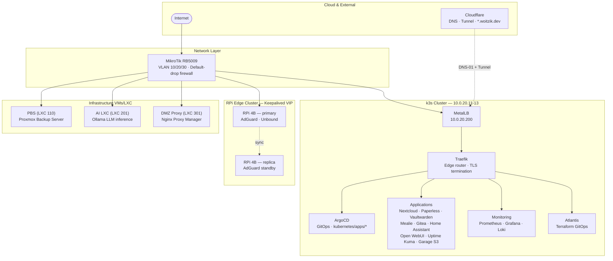

[](https://github.com/dwoitzik/homelab-infrastructure/actions/workflows/ci.yml)


# Homelab Infrastructure as Code

Full-stack homelab managed entirely through Infrastructure as Code — from MikroTik firewall rules to Kubernetes application deployments. All changes flow through pull requests; nothing is applied manually.

## Stack Overview

| Layer | Technology |
|---|---|
| Hypervisor | Proxmox VE (Ryzen 7 5825U, 64 GB RAM) |
| Networking | MikroTik RB5009 (Terraform-managed firewall) |
| Edge DNS | 2× Raspberry Pi 4B — AdGuard Home + Unbound |
| Kubernetes | k3s v1.31 — 3-node cluster (1 control-plane + 2 workers) |
| Ingress + TLS | Traefik + cert-manager (wildcard `*.woitzik.dev` via DNS-01) |
| Storage | Longhorn (distributed block storage, 3× replication) |
| GitOps (k8s) | ArgoCD — ApplicationSet watching `kubernetes/apps/*` |
| GitOps (TF) | Atlantis — self-hosted, exposed via Cloudflare Tunnel |
| Auth | Authelia — SSO/OIDC for all protected services |
| VPN | Headscale (self-hosted Tailscale control plane) |
| Secrets | Ansible Vault (Ansible) + Kubernetes Secrets (cluster) |
| Backups | Velero → Garage S3 (k8s) + PBS → rclone → Google Drive (VMs) |

## Architecture


```mermaid
graph TB
    subgraph cloud["Cloud & External"]
        NET([Internet])
        CF["Cloudflare\nDNS · Tunnel · *.woitzik.dev"]
    end

    subgraph router["Network Layer"]
        MK["MikroTik RB5009\nVLAN 10/20/30 · Default-drop firewall"]
    end

    subgraph k3s["k3s Cluster — 10.0.20.11-13"]
        LB["MetalLB\n10.0.20.200"]
        TR["Traefik\nEdge router · TLS termination"]
        ARGO["ArgoCD\nGitOps · kubernetes/apps/*"]
        APPS["Applications\nNextcloud · Paperless · Vaultwarden\nMealie · Gitea · Home Assistant\nOpen WebUI · Uptime Kuma · Garage S3"]
        MON["Monitoring\nPrometheus · Grafana · Loki"]
        ATL["Atlantis\nTerraform GitOps"]
    end

    subgraph edge["RPi Edge Cluster — Keepalived VIP"]
        RPI1["RPi 4B — primary\nAdGuard · Unbound"]
        RPI2["RPi 4B — replica\nAdGuard standby"]
    end

    subgraph infra["Infrastructure VMs/LXC"]
        PBS["PBS (LXC 110)\nProxmox Backup Server"]
        AI["AI LXC (LXC 201)\nOllama LLM inference"]
        DMZ["DMZ Proxy (LXC 301)\nNginx Proxy Manager"]
    end

    NET --> MK
    CF -. "DNS-01 + Tunnel" .-> LB
    MK --> LB
    LB --> TR
    TR --> ARGO
    TR --> APPS
    TR --> MON
    TR --> ATL
    MK --> RPI1
    RPI1 -. "sync" .-> RPI2
    MK --> PBS
    MK --> AI
    MK --> DMZ
```

## Repository Layout

```
├── kubernetes/
│   ├── apps/                # ArgoCD-managed workloads (ApplicationSet)
│   │   ├── atlantis/        # Terraform GitOps runner
│   │   ├── authelia/        # SSO / OIDC identity provider
│   │   ├── cloudflared/     # Cloudflare Tunnel
│   │   ├── garage/          # S3-compatible object storage
│   │   ├── gitea/           # Private git instance
│   │   ├── headscale/       # Tailscale control plane
│   │   ├── home-assistant/  # Smart home hub
│   │   ├── homepage/        # Dashboard
│   │   ├── mealie/          # Recipe manager
│   │   ├── nextcloud/       # Files · CalDAV · CardDAV
│   │   ├── open-webui/      # Local LLM interface (Ollama)
│   │   ├── paperless/       # Document management
│   │   ├── renovate/        # Dependency update bot
│   │   ├── uptime-kuma/     # Uptime monitoring
│   │   └── vaultwarden/     # Password manager
│   └── system/              # Manually-applied system components
│       ├── argocd/          # ArgoCD config (RBAC, OIDC)
│       ├── cert-manager/    # TLS certificate automation
│       ├── longhorn/        # Distributed storage
│       ├── metallb/         # LoadBalancer IPs
│       ├── monitoring/      # kube-prometheus-stack + Loki + PVE exporter
│       ├── postgres/        # Authelia PostgreSQL
│       ├── redis/           # Authelia Redis
│       ├── traefik/         # Traefik ingress
│       ├── velero/          # Cluster backup to Garage S3
│       ├── apps-ingressroute.yml   # All app IngressRoutes
│       └── other-ingressroute.yml  # System IngressRoutes (ArgoCD, Grafana, Longhorn)
├── terraform/
│   └── stacks/
│       ├── network/         # MikroTik — VLANs, firewall, DHCP, NAT
│       └── proxmox/         # VMs and LXC containers
├── ansible/
│   ├── roles/               # One role per service (14 roles)
│   ├── group_vars/          # Variables + Ansible Vault secrets
│   ├── k3s-cluster/         # k3s provisioning (install, upgrade, reset)
│   └── inventory.ini
├── docker/                  # Docker Compose for DMZ services
│   ├── crafty/              # Minecraft server manager (dmz_games LXC)
│   └── npmplus/             # Nginx Proxy Manager Plus (dmz_proxies LXC)
├── docs/
│   ├── decisions/           # ADR-001 through ADR-004
│   └── *.md                 # Architecture, naming, topology, VLAN docs
├── network/
│   └── scripts/bootstrap.rsc  # MikroTik initial bootstrap (RouterOS script)
├── atlantis.yaml            # Atlantis — stack definitions
└── .github/workflows/ci.yml # Terraform lint + Ansible lint
```

## Kubernetes Services

| Service | URL | Auth |
|---|---|---|
| Homepage | home.woitzik.dev | Authelia |
| ArgoCD | argo.woitzik.dev | Authelia OIDC |
| Grafana | monitoring.woitzik.dev | Authelia OIDC |
| Longhorn | longhorn.woitzik.dev | Authelia |
| Traefik | traefik.woitzik.dev | Authelia |
| Uptime Kuma | status.woitzik.dev | Authelia |
| Paperless-ngx | docs.woitzik.dev | Authelia |
| Open WebUI | ai.woitzik.dev | Authelia |
| Vaultwarden | vault.woitzik.dev | Built-in |
| Nextcloud | nextcloud.woitzik.dev | Built-in |
| Mealie | mealie.woitzik.dev | Authelia |
| Gitea | git.woitzik.dev | Built-in |
| Home Assistant | ha.woitzik.dev | Built-in |
| Headscale | headscale.woitzik.dev | Built-in |
| Atlantis | atlantis.woitzik.dev | GitHub HMAC |
| AdGuard Home | dns.woitzik.dev | Authelia |
| Proxmox VE | pve.woitzik.dev | Authelia OIDC |
| PBS | backup.woitzik.dev | Authelia OIDC |
| MikroTik | router.woitzik.dev | Authelia |
| Garage S3 | s3.woitzik.dev | Key auth |

## VLAN Layout

| VLAN | Zone | Subnet | Key Hosts |
|---|---|---|---|
| 10 | Management | 10.0.10.0/24 | Proxmox (10.0.10.10), PBS (10.0.10.110), MikroTik API (10.0.10.1) |
| 20 | Server | 10.0.20.0/24 | k3s (10.0.20.11-13), RPi (10.0.20.2-3), MetalLB (10.0.20.200) |
| 30 | DMZ | 10.0.30.0/24 | Proxy (10.0.30.2), Games (10.0.30.3) |

## Terraform Workflow

All Terraform changes go through Atlantis (self-hosted GitOps):

```bash
git checkout -b feature/my-change
# edit terraform/stacks/network/*.tf or terraform/stacks/proxmox/*.tf
git push && gh pr create
# Atlantis auto-plans on PR open
# comment "atlantis apply" on the PR to apply
# merge after apply succeeds
```

Never run `terraform apply` locally — all applies go through Atlantis.

## Ansible Workflow

```bash
# Dry run
ansible-playbook ansible/playbooks/site.yml --check

# Apply to specific group
ansible-playbook ansible/playbooks/site.yml --limit rpi_nodes

# Edit secrets
ansible-vault edit ansible/group_vars/all/vault.yml
```

## Adding a New k8s Service

1. Create `kubernetes/apps/<service>/<service>.yml` with Deployment + Service + PVC
2. ArgoCD ApplicationSet auto-detects the new directory and deploys it
3. Add IngressRoute to `kubernetes/system/apps-ingressroute.yml`
4. Run `kubectl apply -f kubernetes/system/apps-ingressroute.yml`

## Monitoring

Prometheus scrapes metrics from all hosts:
- k3s nodes: DaemonSet node_exporter (10.0.20.11-13)
- Raspberry Pis: node_exporter Docker container (10.0.20.2-3)
- Docker LXC: node_exporter Docker container (10.0.20.252)
- AI LXC + PBS: node_exporter native binary (10.0.20.251, 10.0.10.110)
- Proxmox host: prometheus-pve-exporter in-cluster (10.0.10.10)

Grafana dashboards: Node Exporter Full (1860), Proxmox PVE (10347, 19022).

## Documentation

- [Architecture Decision Records](docs/decisions/)
- [k3s Cluster Architecture](docs/k3s-architecture.md)
- [VLAN Segmentation](docs/vlan-segmentation.md)
- [Backup Strategy](docs/backup-strategy.md)
- [SSO Setup (Proxmox/PBS)](docs/SSO_SETUP.md)
- [Naming Convention](docs/naming-convention.md)
- [Roadmap](ROADMAP.md)
