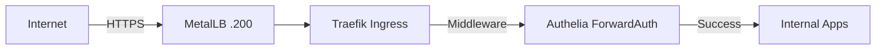

# ☸️ K3s Cluster Architecture

This document outlines the design and components of the Kubernetes layer.

## 1. Cluster Topology
The cluster is currently composed of 3 virtualized nodes running on Proxmox.

| Node Name | IP | Role | Resources |
| :--- | :--- | :--- | :--- |
| `vm-srv-k3s-11` | 10.0.20.11 | Control Plane + Worker | 4 vCPU, 16GB RAM |
| `vm-srv-k3s-12` | 10.0.20.12 | Worker | 4 vCPU, 16GB RAM |
| `vm-srv-k3s-13` | 10.0.20.13 | Worker | 4 vCPU, 16GB RAM |

## 2. Storage Strategy (Longhorn)
We use **Longhorn** for distributed block storage.
- **Replication:** Every volume is replicated 3x across the nodes.
- **Over-provisioning:** Set to 200% to allow for flexible scheduling on limited physical disk space.
- **Reserved Space:** Limited to 10% per node to maximize usable capacity for application volumes.

## 3. Ingress & Traffic Flow
Traffic enters the cluster via a **MetalLB** LoadBalancer IP (`10.0.20.200`).

### Automatic SSL
- **Provider:** Cert-Manager
- **Challenge:** DNS-01 via Cloudflare API
- **Certificate:** Single wildcard `*.woitzik.dev` stored in `kube-system`.
- **Implementation:** Traefik is configured with a default `TLSStore` to use this wildcard cert for all ingresses.

## 4. GitOps Workflow (ArgoCD)
- **Repo:** `dwoitzik/homelab-infrastructure`
- **Path:** `kubernetes/system/` (Core) and `kubernetes/apps/` (Workloads)
- **Sync Policy:** Automated sync with self-healing enabled.
