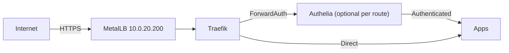

# k3s Cluster Architecture

## 1. Cluster Topology

3-node k3s v1.31 cluster on Proxmox VMs (Debian 13 trixie). **Single-server, not HA, by
deliberate design (corrected 2026-06-23):** a prior attempt at 3-way embedded-etcd HA
caused repeated host freezes — all three VMs share one physical host (`mini`) and one ZFS
pool, so 3 concurrent etcd writers produced enough I/O contention to lock up the host.
`vm-srv-k3s-11` is the sole control-plane + etcd server; `-12`/`-13` are agent (worker)
nodes only, providing compute capacity without adding etcd writers. **Do not re-introduce
multi-server etcd on this hardware** — see `docs/compute-nodes.md` for the full incident
writeup. Target is fast *recovery*, not zero-downtime HA: `mini` is a single point of
failure either way.

| Node | IP | Role | vCPU | RAM |
|---|---|---|---|---|
| `vm-srv-k3s-11` | 10.0.20.11 | Control Plane + etcd + Worker (sole server) | 4 | 12 GB |
| `vm-srv-k3s-12` | 10.0.20.12 | Worker (agent only, no etcd) | 4 | 8 GB |
| `vm-srv-k3s-13` | 10.0.20.13 | Worker (agent only, no etcd) | 4 | 8 GB |

All three have `on_boot = true` in Terraform — they auto-start on host reboot.

**API endpoint**: `10.0.20.10` — a Keepalived VIP (VRRP, router-id 52) sits in front of
the API server, currently always resolving to k3s-11 since it's the only node actually
running `kube-apiserver`. **Known caveat:** Keepalived's failover priority list still
includes k3s-12/13 from the old 3-master design — if k3s-11 goes down, the VIP could float
to a node with no API server at all, making it *more* broken than just using k3s-11's IP
directly. If k3s-11 is down, go straight to `10.0.20.11` (or rebuild it — see
`DISASTER-RECOVERY.md`) rather than trusting the VIP to land somewhere useful.

- Ansible: `ansible/k3s-vip.yml` (Keepalived setup) — priorities need revisiting given the
  topology correction above; not yet done as of 2026-06-23.

## 2. Storage (NFS + local-path)

Longhorn was removed (2026-06 migration, see ROADMAP.md). Most PVCs use the `nfs-client`
storage class, backed by `ct-srv-nfs-01` (10.0.20.100, ZFS-backed export). There is no
in-cluster replication for PV data — durability relies entirely on the NFS server's ZFS
redundancy plus Velero backups (see `docs/backup-strategy.md`).

**`nfs-client` is NOT safe for embedded databases** (SQLite, BoltDB, etc.) — NFS's
locking/WAL model is incompatible with how these engines manage concurrent access.
Garage's metadata store corrupted this way in practice, which is what prompted the migration below.
Every app found to be SQLite-backed was migrated to `local-path` instead: Garage
(`garage-meta`), Headscale, Vaultwarden, Gitea, Mealie, Open WebUI, Home Assistant
(paperless-ai was removed entirely as a service, unrelated to storage). **`local-path`
PVs are node-pinned** — a pod using one can only ever schedule
back onto the node it first bound to; if that node is lost, the data is gone unless
restored from a Velero backup. New apps with an embedded DB should default to
`local-path`, not `nfs-client`.

- Default storage class: `nfs-client` (bulk/shared data, blob storage, anything without
  its own locking-sensitive embedded DB)
- `local-path` (k3s built-in, node-local): embedded-DB apps listed above, plus uptime-kuma
- NFS server: `ct-srv-nfs-01` (10.0.20.100) — only 2GB RAM as of 2026-06-23 (was 512MB,
  OOM-killed once already); see `docs/compute-nodes.md`
- Exception: `media` PVC (Jellyfin) is a direct NFS mount to the Proxmox host, not
  provisioned via the nfs-client provisioner

## 3. Ingress & Traffic Flow

External traffic enters via MetalLB (IP `10.0.20.200`) and routes through Traefik.

```mermaid
graph LR
    Internet -->|HTTPS| MetalLB["MetalLB 10.0.20.200"]
    MetalLB --> Traefik["Traefik"]
    Traefik -->|ForwardAuth| Authelia["Authelia (optional per route)"]
    Authelia -->|Authenticated| Apps["Apps"]
    Traefik -->|Direct| Apps
```

- **TLS:** Single wildcard cert `*.woitzik.dev` via cert-manager (DNS-01, Cloudflare)
- **Cert location:** Secret `wildcard-woitzik-dev-tls` in `kube-system`
- **IngressRoutes:** Defined in `kubernetes/system/apps-ingressroute.yml` and `other-ingressroute.yml`

## 4. GitOps (ArgoCD)

ArgoCD manages all cluster resources via two patterns:

- **ApplicationSet** (`homelab-apps`): auto-deploys every directory under `kubernetes/apps/*`
- **Manual Applications**: system components in `kubernetes/system/` applied with `kubectl apply`

Sync policy: automated with `prune: true` and `selfHeal: true` — manual changes to ArgoCD-managed resources are reverted.

## 5. Namespaces

| Namespace | Contents |
|---|---|
| `apps` | All user-facing applications |
| `database` | Authelia PostgreSQL + Redis |
| `monitoring` | Prometheus, Grafana, Loki, Alertmanager, PVE exporter |
| `argocd` | ArgoCD |
| `vault` | HashiCorp Vault + `vault-unseal` auto-unseal sidecar |
| `velero` | Velero + node-agent (kopia) |
| `kube-system` | Traefik, MetalLB, cert-manager, wildcard TLS cert, `sysctl-fix` DaemonSet |

NetworkPolicies (default-deny + explicit allow) are deployed in `apps` and `monitoring`
(`kubernetes/apps/network-policies.yml`, `kubernetes/system/monitoring/network-policies.yml`).
`kube-system` and `vault`/`velero` have no default-deny — cross-namespace traffic there is
unrestricted. When adding a new cross-namespace dependency into `apps` or `monitoring`,
check these files first; a missing allow-rule here was the cause of two outages on
2026-06-19 (Velero → Garage S3, Homepage → Uptime Kuma).

## 6. Monitoring

Prometheus scrapes from both in-cluster and external targets:

| Target | Method | Port |
|---|---|---|
| k3s nodes (10.0.20.11-13) | DaemonSet | 9100 |
| RPi-01, RPi-02 (10.0.20.2-3) | Static config | 9100 |
| Docker LXC (10.0.20.252) | Static config | 9100 |
| AI LXC (10.0.20.251) | Static config | 9100 |
| PBS (10.0.10.110) | Static config | 9100 |
| Media-acq, Jellyfin, Atlantis LXCs | Static config (`node_exporter_native`, added after this doc was first written -- see ADR-012 for the Atlantis LXC) | 9100 |
| DMZ proxy + games LXCs (10.0.30.2-3) | Static config (`monitoring_agent` role's docker-based node_exporter, distinct from `node_exporter_native` used elsewhere) | 9100 |
| Proxmox host (10.0.10.10) | PVE exporter in-cluster | 9221 |

Grafana dashboards (auto-downloaded): 1860 (Node Exporter Full), 10347 + 19022 (Proxmox).
