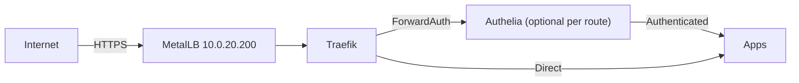

# k3s Cluster Architecture

## 1. Cluster Topology

3-node k3s v1.31 cluster on Proxmox VMs (Debian 13 trixie). **HA since 2026-06-19**: all
three nodes run as servers with embedded etcd (migrated live from single-node SQLite via
`--cluster-init`, no downtime beyond a ~60s API restart).

| Node | IP | Role | vCPU | RAM (dedicated/balloon) |
|---|---|---|---|---|
| `vm-srv-k3s-11` | 10.0.20.11 | Control Plane + etcd + Worker | 4 | 12 GB (balloon 4–12) |
| `vm-srv-k3s-12` | 10.0.20.12 | Control Plane + etcd + Worker | 4 | 16 GB (balloon 4–16) |
| `vm-srv-k3s-13` | 10.0.20.13 | Control Plane + etcd + Worker | 4 | 16 GB (balloon 4–16) |

Balloon memory enables overcommit — nodes start at 4 GB and scale up to their max as workloads demand.

**API HA endpoint**: `10.0.20.10` — Keepalived VIP (VRRP, router-id 52) across all three
nodes. MASTER priority: k3s-11 (150) > k3s-12 (120) > k3s-13 (100), tracked via a
`chk_k3s` vrrp_script that checks `systemctl is-active k3s`. kubeconfig and all
Ansible/CI access should target the VIP, not a specific node IP.

- Ansible: `ansible/k3s-vip.yml` (Keepalived setup), `ansible/k3s-cluster/inventory-ha.yml` (target inventory for the etcd migration, kept for reference/rebuilds)
- If the VIP itself is ever unreachable: any single node IP (`.11`/`.12`/`.13`) still serves the API directly.

## 2. Storage (NFS)

Longhorn was removed (2026-06 migration, see ROADMAP.md). All PVCs use the `nfs-client`
storage class, backed by `ct-srv-nfs-01` (10.0.20.100, ZFS-backed export). There is no
in-cluster replication for PV data — durability relies entirely on the NFS server's ZFS
redundancy plus Velero backups (see `docs/backup-strategy.md`).

- Storage class: `nfs-client` (default for all PVCs)
- NFS server: `ct-srv-nfs-01` (10.0.20.100)
- Exception: `media` PVC (Jellyfin) is a direct NFS mount, not provisioned via the nfs-client provisioner

## 3. Ingress & Traffic Flow

External traffic enters via MetalLB (IP `10.0.20.200`) and routes through Traefik.

```mermaid
graph LR
    Internet -->|HTTPS| MetalLB["MetalLB 10.0.20.200"]
    MetalLB --> Traefik["Traefik"]
    Traefik -->|ForwardAuth| Authelia["Authelia (optional per route)"]
    Authelia -->|Authenticated| Apps["Apps"]
    Traefik -->|Direct| Apps
```

- **TLS:** Single wildcard cert `*.woitzik.dev` via cert-manager (DNS-01, Cloudflare)
- **Cert location:** Secret `wildcard-woitzik-dev-tls` in `kube-system`
- **IngressRoutes:** Defined in `kubernetes/system/apps-ingressroute.yml` and `other-ingressroute.yml`

## 4. GitOps (ArgoCD)

ArgoCD manages all cluster resources via two patterns:

- **ApplicationSet** (`homelab-apps`): auto-deploys every directory under `kubernetes/apps/*`
- **Manual Applications**: system components in `kubernetes/system/` applied with `kubectl apply`

Sync policy: automated with `prune: true` and `selfHeal: true` — manual changes to ArgoCD-managed resources are reverted.

## 5. Namespaces

| Namespace | Contents |
|---|---|
| `apps` | All user-facing applications |
| `database` | Authelia PostgreSQL + Redis |
| `monitoring` | Prometheus, Grafana, Loki, Alertmanager, PVE exporter |
| `argocd` | ArgoCD |
| `vault` | HashiCorp Vault + `vault-unseal` auto-unseal sidecar |
| `velero` | Velero + node-agent (kopia) |
| `kube-system` | Traefik, MetalLB, cert-manager, wildcard TLS cert, `sysctl-fix` DaemonSet |

NetworkPolicies (default-deny + explicit allow) are deployed in `apps` and `monitoring`
(`kubernetes/apps/network-policies.yml`, `kubernetes/system/monitoring/network-policies.yml`).
`kube-system` and `vault`/`velero` have no default-deny — cross-namespace traffic there is
unrestricted. When adding a new cross-namespace dependency into `apps` or `monitoring`,
check these files first; a missing allow-rule here was the cause of two outages on
2026-06-19 (Velero → Garage S3, Homepage → Uptime Kuma).

## 6. Monitoring

Prometheus scrapes from both in-cluster and external targets:

| Target | Method | Port |
|---|---|---|
| k3s nodes (10.0.20.11-13) | DaemonSet | 9100 |
| RPi-01, RPi-02 (10.0.20.2-3) | Static config | 9100 |
| Docker LXC (10.0.20.252) | Static config | 9100 |
| AI LXC (10.0.20.251) | Static config | 9100 |
| PBS (10.0.10.110) | Static config | 9100 |
| Proxmox host (10.0.10.10) | PVE exporter in-cluster | 9221 |

Grafana dashboards (auto-downloaded): 1860 (Node Exporter Full), 10347 + 19022 (Proxmox).
