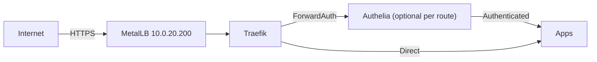

# k3s Cluster Architecture

## 1. Cluster Topology

3-node k3s v1.31 cluster on Proxmox VMs (Debian 13 trixie).

| Node | IP | Role | vCPU | RAM (dedicated/balloon) |
|---|---|---|---|---|
| `vm-srv-k3s-11` | 10.0.20.11 | Control Plane + Worker | 4 | 12 GB (balloon 4–12) |
| `vm-srv-k3s-12` | 10.0.20.12 | Worker | 4 | 16 GB (balloon 4–16) |
| `vm-srv-k3s-13` | 10.0.20.13 | Worker | 4 | 16 GB (balloon 4–16) |

Balloon memory enables overcommit — nodes start at 4 GB and scale up to their max as workloads demand.

## 2. Storage (Longhorn)

Longhorn provides distributed block storage with 3× replication across all nodes.

- Replication factor: 3
- Over-provisioning: 200%
- Reserved space per node: 10%
- Storage class: `longhorn` (default for all PVCs)

## 3. Ingress & Traffic Flow

External traffic enters via MetalLB (IP `10.0.20.200`) and routes through Traefik.

```mermaid
graph LR
    Internet -->|HTTPS| MetalLB["MetalLB 10.0.20.200"]
    MetalLB --> Traefik["Traefik"]
    Traefik -->|ForwardAuth| Authelia["Authelia (optional per route)"]
    Authelia -->|Authenticated| Apps["Apps"]
    Traefik -->|Direct| Apps
```

- **TLS:** Single wildcard cert `*.woitzik.dev` via cert-manager (DNS-01, Cloudflare)
- **Cert location:** Secret `wildcard-woitzik-dev-tls` in `kube-system`
- **IngressRoutes:** Defined in `kubernetes/system/apps-ingressroute.yml` and `other-ingressroute.yml`

## 4. GitOps (ArgoCD)

ArgoCD manages all cluster resources via two patterns:

- **ApplicationSet** (`homelab-apps`): auto-deploys every directory under `kubernetes/apps/*`
- **Manual Applications**: system components in `kubernetes/system/` applied with `kubectl apply`

Sync policy: automated with `prune: true` and `selfHeal: true` — manual changes to ArgoCD-managed resources are reverted.

## 5. Namespaces

| Namespace | Contents |
|---|---|
| `apps` | All user-facing applications |
| `database` | Authelia PostgreSQL + Redis |
| `monitoring` | Prometheus, Grafana, Loki, Alertmanager, PVE exporter |
| `argocd` | ArgoCD |
| `longhorn-system` | Longhorn |
| `kube-system` | Traefik, MetalLB, cert-manager, wildcard TLS cert |

## 6. Monitoring

Prometheus scrapes from both in-cluster and external targets:

| Target | Method | Port |
|---|---|---|
| k3s nodes (10.0.20.11-13) | DaemonSet | 9100 |
| RPi-01, RPi-02 (10.0.20.2-3) | Static config | 9100 |
| Docker LXC (10.0.20.252) | Static config | 9100 |
| AI LXC (10.0.20.251) | Static config | 9100 |
| PBS (10.0.10.110) | Static config | 9100 |
| Proxmox host (10.0.10.10) | PVE exporter in-cluster | 9221 |

Grafana dashboards (auto-downloaded): 1860 (Node Exporter Full), 10347 + 19022 (Proxmox).
