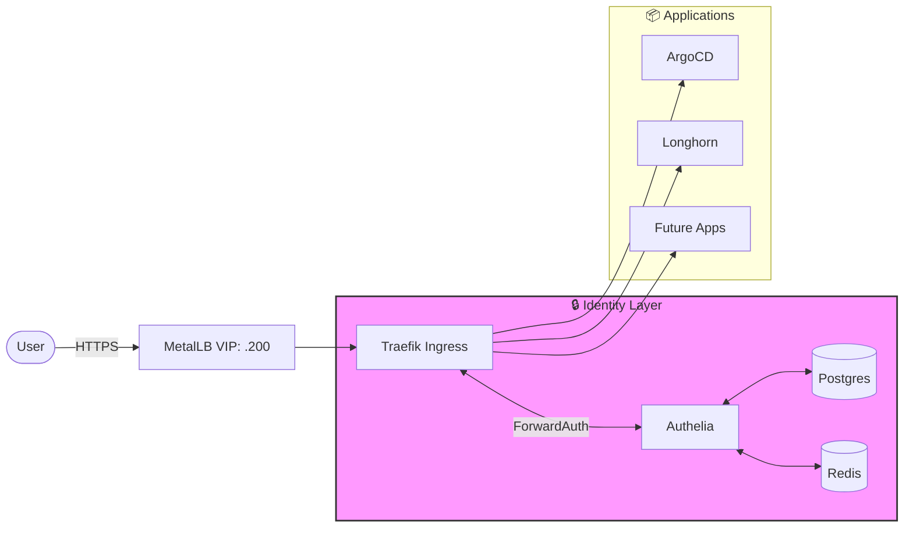

# ☸️ K3s GitOps Cluster

This directory manages the **Cloud-Native layer** of the homelab. By moving from standalone Docker containers to a coordinated K3s cluster, we achieve automated SSL management, resilient distributed storage, and centralized identity-aware routing.

## 🛠️ Infrastructure Stack

| Component | Technology | Role |
|---|---|---|
| **Distribution** | K3s (Lightweight Kubernetes) | Orchestration & Lifecycle |
| **GitOps** | ArgoCD | Declarative Deployment & Self-healing |
| **Ingress Controller** | Traefik | Layer 7 Routing & Middleware |
| **Storage** | Longhorn | Distributed Block Storage (Replicated) |
| **Certificates** | Cert-Manager + Cloudflare | Automated Wildcard SSL (DNS-01) |
| **Load Balancer** | MetalLB | Layer 2 VIP Management (10.0.20.200+) |
| **Security** | Authelia | SSO & Portal-based MFA |

## 🗺️ Traffic Architecture



## 🚀 Core Concepts

### 1. Automatic Wildcard SSL
Unlike the manual setup in Nginx Proxy Manager, this cluster uses **Cert-Manager** with the **Cloudflare DNS-01 challenge**. It maintains a single `*.woitzik.dev` certificate globally. Traefik is configured via a `TLSStore` to automatically serve this certificate to any Ingress without requiring individual secret definitions.

### 2. Distributed Persistence
By using **Longhorn**, every database (Postgres, Redis) and stateful app has its data replicated across multiple nodes. This eliminates the "single point of failure" of local Docker mounts and allows pods to migrate between nodes without data loss.

### 3. The "NPM Killer": Middleware-based Auth
The most significant improvement over the legacy NPM setup is the **Authelia ForwardAuth Middleware**. 
- **Legacy:** Manual `auth_forward` snippets in NPM for every proxy host.
- **GitOps:** Simply add an annotation to any Ingress to protect it with Authelia:
  ```yaml
  traefik.ingress.kubernetes.io/router.middlewares: kube-system-authelia@kubernetescrd
  ```

## 📁 Repository Layout

```text
├── system/                   # Core infrastructure (System-level)
│   ├── argocd-config/        # Ingress & self-management
│   ├── certificates/         # Wildcard cert & ClusterIssuer
│   ├── longhorn/             # Storage management
│   ├── traefik/              # Ingress controller & Middlewares
│   └── postgres/             # Shared DBs for system tools
└── apps/                     # User-facing applications
    └── authelia/             # SSO & Identity provider
```

## 🔄 Operations

### Adding a New App
1. Create a new directory in `apps/`.
2. Define an ArgoCD `Application` in `system/`.
3. Push to `main`. ArgoCD will detect the change and provision the resources.

### Secrets Management
*Currently: Managed via manual Kubernetes Secrets (Migration to SealedSecrets or External Secrets Operator planned).*